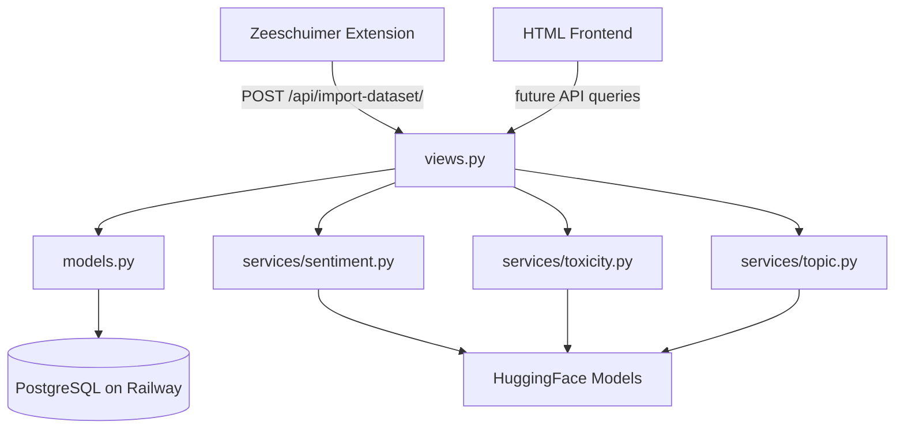

# ClearFeed — Architecture Overview

## What is ClearFeed?

ClearFeed is a social media feed analysis tool. Users browse Twitter/X normally in Firefox, then click "To FeedFreak" in a browser extension to upload what they saw. The Django backend stores the data and runs NLP analysis on each tweet. A plain HTML frontend will display these model results and other basic statistics in the dashboards. Users will be able to review an overarching feed analysis dashboard, as well as analyses on specific browsing sessions.

---

## High-Level Data Flow

```
User browses Twitter in Firefox
        ↓
Zeeschuimer extension captures NDJSON in the background
        ↓
User clicks "To ClearFeed" in the extension popup
        ↓
Extension POSTs raw NDJSON to Django at /api/import-dataset/
        ↓
Django ingestion pipeline (views.py) parses and stores data in PostgreSQL (Railway)
        ↓
NLP analysis runs synchronously during ingestion (sentiment, toxicity, topic)
        ↓
Results stored in analysis result tables
        ↓
HTML frontend queries Django API endpoints to display dashboards
```

---

## Components

### 1. Zeeschuimer Firefox Extension
**Repo:** https://github.com/teddykolios11/capp-zeeschuimer

This is a fork of the open-source Zeeschuimer extension, modified to send data to ClearFeed instead of 4CAT. As the user scrolls Twitter, the extension intercepts Twitter's internal API responses and stores them locally as NDJSON (newline-delimited JSON). When the user clicks "To ClearFeed", the extension POSTs the collected NDJSON as a raw blob to `http://localhost:8000/api/import-dataset/` with an `X-Zeeschuimer-Platform` header identifying the platform.

Key files:
- `popup/interface.js` — handles the upload button and fetch POST
- `popup/interface.html` — the extension popup UI

#### Changes from upstream Zeeschuimer
- `manifest.json` — removed `update_url` from `browser_specific_settings.gecko` (required by Mozilla for unsigned local extensions); added `id` field: `clearfeed-zeeschuimer@clearfeed.com`
- `popup/interface.html` — removed entire "Connect to 4CAT" section including the URL input field; moved upload-status paragraph inside the status section so progress messages still display correctly
- `popup/interface.js` — added `const CLEARFEED_URL = 'http://localhost:8000'`; modified `activate_buttons()` to remove `have_4cat` dependency so "To FeedFreak" button enables based only on whether items exist; replaced the upload-to-4cat XHR block with a simple `fetch` POST to `/api/import-dataset/` sending raw NDJSON blob with `X-Zeeschuimer-Platform` header; removed two lines from `DOMContentLoaded` that referenced the now-deleted `#fourcat-url` input

#### Open TODOs — Extension
- [ ] Set up `develop`/`main` branches and branch protection rules in forked Zeeschuimer extension repo
- [ ] Clarify with James where this fits in the overall architecture
- [ ] Auto-clear extension local data after a successful upload so each new browsing session starts fresh; this prevents duplicate sessions where posts were already uploaded (this happens when one browsing session starts where the last one ended)
- [ ] Remove platform options we aren't processing — keep only Twitter/X
- [ ] Remove "Uploaded Datasets" section from the extension UI
- [ ] Reformat UI to ClearFeed branding — decide whether to keep the Zeeschuimer name or rebrand

---

### 2. Django Backend
**Location:** `backend/` in the main ClearFeed repo

The backend is a Django application connected to a PostgreSQL database hosted on Railway. It has one primary endpoint today:

- `POST /api/import-dataset/` — receives NDJSON from the extension, runs the ingestion pipeline, and triggers NLP analysis synchronously

The backend is also responsible for serving API endpoints to the HTML frontend (in progress).

---

### 3. PostgreSQL Database (Railway)
The database has 10 tables. See `decisions/schema.md` for the full schema. The key tables are:

- `app_user` — one row per user (hardcoded UUIDs for now, real auth later)
- `browse_session` — one row per upload, tracking lifecycle status
- `twitter_author` — one row per unique Twitter author, updated on each appearance
- `tweet` — one row per unique tweet, stored once globally
- `tweet_media` — photos and videos attached to tweets
- `viewed_tweet` — one row every time a user sees a tweet, with engagement stats at that moment
- `sentiment_result`, `topic_result`, `toxicity_result`, `political_leaning`  — NLP analysis results per tweet

---

### 4. NLP Analysis Services
**Location:** `backend/api/services/`

Three analysis services run synchronously during ingestion:

- `sentiment.py` — classifies tweet text as positive, negative, or neutral
- `toxicity.py` — classifies tweet text as toxic, non-toxic, hate etc.
- `topic.py` — classifies tweet text into topic categories (politics, sports, entertainment etc.)
- `political_leaning` - not implemented yet because our model is currently specific to U.S. politics, so need to think through this

Each service exposes a single function (`analyze_sentiment_text`, `analyze_toxicity_text`, `analyze_topic_text`) that takes tweet text and returns a label and confidence score. Results are written to their respective tables immediately after each tweet is ingested.

---

### 5. HTML Frontend
**Location:** `frontend/` in the main ClearFeed repo

Plain HTML, CSS, and JavaScript. The frontend will query Django API endpoints and render analysis dashboards showing what the user has been exposed to across their browsing sessions.

---

## The Ingestion Pipeline

The core of the backend is the `import_dataset` view in `backend/api/views.py`. It runs in 7 sequential steps every time the extension uploads data:

**Step 1 — App User:** Look up or create the user record. Currently uses a hardcoded UUID; will use real auth tokens later.

**Step 2 — Browse Session:** Create a new session record with status `ingesting`. Every upload = one session.

**Step 3 — Twitter Authors:** For each post, parse the author's profile from `data.core.user_results.result`. If the author already exists in the database, update their mutable fields (followers count, bio, etc.). If they are new, create a full record.

**Step 4 — Tweets:** For each post, insert the tweet if it doesn't already exist (`get_or_create`). Tweets are immutable — if we've seen this tweet before we skip it. Immediately after insertion, NLP analysis runs on the tweet text and results are written to the analysis tables.

**Step 5 — Tweet Media:** Store any photos or videos attached to each tweet, keyed by `media_key`. The same media can appear across multiple tweets but is only stored once.

**Step 6 — Viewed Tweets:** Always insert a new row recording this user seeing this tweet in this session, with engagement stats (likes, retweets, views) captured at the moment of viewing. This is intentionally separate from the tweet itself so we can track how engagement changes over time across sessions.

**Step 7 — Session Complete:** Mark the session status as `complete` and record `ended_at`.

---

## Analysis Queue — Current State and Future Plan

### Current: Synchronous Analysis
NLP analysis currently runs synchronously inside the ingestion request. After each tweet is inserted in Step 4, the pipeline immediately calls `analyze_sentiment_text`, `analyze_toxicity_text`, and `analyze_topic_text` on the tweet's `full_text`, then writes results to the database before moving to the next tweet. The session only completes after all tweets in the batch have been analyzed.

This works for small uploads but has two problems at scale. First, the HTTP request from the extension stays open the entire time analysis is running — if a session has 100 tweets and each takes 500ms to analyze, the extension waits 50 seconds for a response. Second, HuggingFace models are CPU-heavy and running them synchronously blocks the Django worker from handling any other requests.

### Future: Async Queue with Celery (maybe?)
The `browse_session.status` and `tweet.analysis_status` fields are designed to support an async queue. The planned architecture is:

```
Extension POSTs NDJSON
        ↓
Django ingestion runs Steps 1–7 (no analysis)
Session status → 'queued'
        ↓
Celery(?) task triggered: analyze_session.delay(session_id)
        ↓
Celery(?) worker picks up task
Session status → 'analyzing'
Tweet analysis_status → 'processing' (per tweet)
        ↓
Worker runs HuggingFace models on each pending tweet
Writes results to sentiment_result, toxicity_result, topic_result, political_leaning (if including)
Tweet analysis_status → 'complete'
        ↓
All tweets done
Session status → 'complete'
```

The extension gets an immediate `200 OK` response with the `session_id` after ingestion. The frontend can then poll `GET /api/sessions/{session_id}/status/` to check when analysis is done and results are ready to display.

To implement this:
1. Add Celery and a message broker (Redis or RabbitMQ) to the stack (still need to finalize tools to use here)
2. Move NLP calls out of `views.py` and into a `tasks.py` Celery task
3. Change Step 7 to set `session.status = 'queued'` and call `analyze_session.delay(str(session.id))` instead of `'complete'`
4. Add a status polling endpoint for the frontend

---

## What's Not Built Yet

- Real user authentication
- Django API endpoints for the frontend to query
- HTML frontend dashboards
- Async analysis queue (Celery?) — analysis currently runs synchronously during ingestion
- Auto-clear of extension local data after successful upload
- Political leaning analysis (model not yet integrated)

# ClearFeed — Dependency Graph

