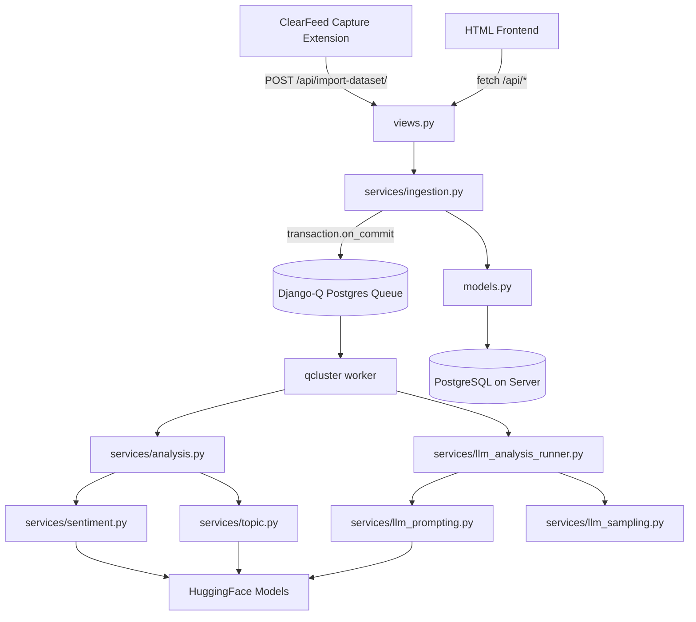

# ClearFeed — Architecture Overview

## What is ClearFeed?

ClearFeed is a social media feed analysis tool. Users browse Twitter/X normally in Firefox, then click "To ClearFeed" in the ClearFeed Capture browser extension to upload what they saw. The Django backend ingests the data, runs NLP analysis on each tweet, and serves analysis dashboards showing what the user has been exposed to across their browsing sessions.

---

## High-Level Data Flow

```
User browses Twitter/X in Firefox
        ↓
ClearFeed Capture extension captures NDJSON in the background
        ↓
User clicks "To ClearFeed" in the extension popup
        ↓
Extension POSTs raw NDJSON to Django at /api/import-dataset/
with session cookie via credentials: 'include'
        ↓
import_dataset() authenticates user via session cookie
        ↓
ingest_posts() runs inside transaction.atomic()
  1. Parse NDJSON
  2. Create BrowseSession
  3. Upsert TwitterAuthors
  4. Insert Tweets, TweetMedia, ViewedTweets
  5. Queue session for analysis
        ↓
transaction.on_commit() fires → Django-Q task queued in Postgres
        ↓
qcluster worker picks up → analyze_session() runs NLP models
        ↓
Results stored in SentimentResult, TopicResult
        ↓
LLM blurb generated and stored in LLMAnalysisRun
        ↓
Frontend queries /api/feed-summary/ to display dashboards
```

---

## Components

### 1. ClearFeed Capture Browser Extension
**Repo:** https://github.com/teddykolios11/ClearFeed-Capture

A fork of the open-source [Zeeschuimer](https://github.com/digitalmethodsinitiative/zeeschuimer) extension, modified to send data to ClearFeed instead of 4CAT. As the user scrolls Twitter, the extension intercepts Twitter's internal API responses and stores them locally as NDJSON. When the user clicks "To ClearFeed", the extension POSTs the collected NDJSON as a raw blob to `/api/import-dataset/`.

Key files:
- `popup/interface.js` — upload button logic, fetch POST, error handling         auto-delete after upload
- `popup/interface.html` — extension popup UI with ClearFeed branding
- `manifest.json` — extension configuration, scoped to Twitter/X only
- `modules/twitter.js` — Twitter API response interceptor

---

### 2. The Ingestion Pipeline

The core of the backend is `ingest_posts()` in `backend/api/services/ingestion.py`, called by the `import_dataset` view every time the extension uploads data. The entire pipeline runs inside `transaction.atomic()` — if anything fails mid-pipeline, all writes roll back and no partial data is saved.

**Step 1 — Authentication:** `import_dataset` checks `request.user.is_authenticated` via the session cookie sent by the extension. Returns 401 immediately if not logged in.

**Step 2 — Browse Session:** Creates a new `BrowseSession` record with status `QUEUED`. Every upload = one session.

**Step 3 — Twitter Authors:** For each post, upserts the tweet author into `twitter_author`. If the author already exists, updates mutable fields (followers count, bio, screen name etc.) while leaving `account_created_at` immutable. Null filtering ensures we never overwrite good data with incomplete API responses.

**Step 4 — Tweets:** Inserts each tweet via `get_or_create` — tweets are immutable after first insert. If the tweet has been seen before (by any user, in any session) it is skipped. The `promoted` field is set here based on whether Twitter flagged the tweet as a paid ad.

**Step 5 — Tweet Media:** Stores photos and videos attached to each tweet, keyed by `media_key`. The same media shared across multiple tweets is stored only once.

**Step 6 — Viewed Tweets:** Always inserts a new row recording this user seeing this tweet in this session, with engagement stats (likes, retweets, views) captured at the moment of viewing. The same tweet can have many `viewed_tweet` rows across users and sessions.

**Step 7 — Queue Analysis:** Marks the session as `QUEUED` and enqueues an async `analyze_session` task via Django-Q. Uses `transaction.on_commit()` so the task is only queued after all writes are committed — preventing the worker from picking up the task before tweets exist in the database. A second `on_commit` callback invalidates the feed summary cache so the user sees updated stats immediately.

---

### 3. Django Backend
**Location:** `backend/` in the main ClearFeed repo

Django application connected to a PostgreSQL database on the server at `clearfeed.civic.garden`. Served via Gunicorn on port 8010, proxied by Caddy.

---

### 4. PostgreSQL Database
Hosted on the server at `clearfeed.civic.garden` via Unix socket at `/run/postgresql/.s.PGSQL.5999`.

Key tables:
- `app_user` — one row per ClearFeed user (extends Django's AbstractBaseUser)
- `browse_session` — one row per upload, tracks ingestion and analysis lifecycle
- `twitter_author` — one row per unique Twitter account, upserted on each upload
- `tweet` — one row per unique tweet, globally deduplicated
- `tweet_media` — photos and videos attached to tweets
- `viewed_tweet` — one row per user/session/tweet event, with engagement snapshot
- `sentiment_result` — sentiment analysis results per tweet (OneToOne with tweet)
- `topic_result` — topic classification results per tweet (OneToOne with tweet)
- `llm_analysis_run` — LLM-generated feed blurb per user, one row per run

---

### 5. NLP Analysis Services
**Location:** `backend/api/services/`

Two HuggingFace models run asynchronously via Django-Q after each upload:

- `sentiment.py` — [cardiffnlp/twitter-roberta-base-sentiment-latest](https://huggingface.co/cardiffnlp/twitter-roberta-base-sentiment-latest) — positive / negative / neutral
- `topic.py` — [cardiffnlp/tweet-topic-21-multi](https://huggingface.co/cardiffnlp/tweet-topic-21-multi) — 21 topic categories

Models are independent — a failure in one does not block the other.

---

### 6. LLM Feed Blurb

**Location:** `backend/api/services/llm_analysis_runner.py`, `llm_prompting.py`, `llm_sampling.py`

After NLP analysis completes, an LLM generates a personalized feed blurb for the user. The LLM is configured via the `LLM_ANALYSIS_MODEL` environment variable.

The pipeline:
1. `llm_sampling.py` — samples a set of the user's tweets
2. `llm_prompting.py` — builds a prompt combining the sampled tweets with feed-wide stats from `build_feed_summary()` (topics, sentiment, word frequency, promoted percentage)
3. The model generates a prose reflection — a short, natural-language character blurb describing what the feed suggests about the user
4. The result is stored in `llm_analysis_run` with status, raw output, structured result, and sample metadata

The `LLMAnalysisRun` table tracks each run with:
- `user` — FK to AppUser
- `status` — QUEUED / PROCESSING / COMPLETE / FAILED
- `sample_size` and `sample_seed` — reproducibility
- `model_name` — which model was used
- `sample_metadata` — tweet IDs sampled and feed summary context used in the prompt
- `result` — structured JSON output (currently a `reflection` field containing prose)
- `raw_output` — raw model output for debugging

The blurb is fetched via `/api/feed-summary/` as part of the `llm_analysis` key, which returns the status, reflection text, run ID, model name, and timestamp of the most recent completed run for the user.

---

### 7. Django-Q2 Async Queue
**Config:** Postgres-backed via `orm: 'default'` — no Redis required.

After ingestion completes, `enqueue_session_analysis()` queues an `analyze_session` task using `transaction.on_commit()`. This ensures the task is only queued after all database writes from ingestion have committed — preventing the worker from picking up a task before its tweets exist.

```python
Q_CLUSTER = {
    'name': 'clearfeed',
    'workers': 1,
    'timeout': 1200,   # 20 minutes
    'retry': 1500,     # 25 minutes
    'orm': 'default',
}
```

The `qcluster` worker runs as a persistent systemd user service on the server.

---

### 8. Frontend
Plain HTML, CSS, and JavaScript. Pages extend `base.html` and fetch data from Django API endpoints.

Key pages:
- `/` — home page with basic user stats and scroll nudge
- `/feed-summary/` — scrollable multi-section feed analysis dashboard

The feed summary uses a variety of graphics to represent user data, including a bar chart created through Apache ECharts and a Wordcloud based on a D3 plug-in by Jason Davies. The dollar sign animation and the sentiment dial were built in-house.

- `/onboarding/` — step-by-step setup guide with Firefox detection and extension install link
- `/landing/` — public landing page for unauthenticated users
- `/privacy/` — privacy policy


# ClearFeed — Dependency Graph


```mermaid
flowchart TD
    EXT[ClearFeed Capture Extension] -->|POST /api/import-dataset/| VIEWS[views.py]
    VIEWS --> ING[services/ingestion.py]
    ING --> MODELS[models.py]
    ING -->|transaction.on_commit| DQ[(Django-Q Postgres Queue)]
    DQ --> WORKER[qcluster worker]
    WORKER --> ANALYSIS[services/analysis.py]
    ANALYSIS --> SENT[services/sentiment.py]
    ANALYSIS --> TOP[services/topic.py]
    WORKER --> LLM[services/llm_analysis_runner.py]
    LLM --> PROMPT[services/llm_prompting.py]
    LLM --> SAMPLE[services/llm_sampling.py]
    SENT --> HF[HuggingFace Models]
    TOP --> HF
    PROMPT --> HF
    MODELS --> DB[(PostgreSQL on Server)]
    FRONT[HTML Frontend] -->|fetch /api/*| VIEWS
```